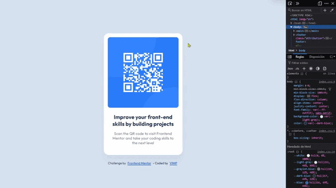

# Frontend Mentor - QR code component solution

This is a solution to the [QR code component challenge on Frontend Mentor](https://www.frontendmentor.io/challenges/qr-code-component-iux_sIO_H).

Frontend Mentor challenges help you improve your coding skills by building realistic projects. 

## Table of contents

🔳 [Screenshot](#screenshot-camera)

🔳 [Links](#links-link)

🔳 [Built with](#built-with-hammer_and_pick)

🔳 [Author](#author-beginner)

## *Screenshot* :camera:

## *Links* :link:

[Live site URL](https://mendezpvi.github.io/fm-qr-code-component-main/) 👀

[Solution in Frontend Mentor](https://www.frontendmentor.io/solutions/qr-code-component-kvtL0fwiDf) 👀

[Challenges overcome](https://github.com/mendezpvi/frontend-mentor-challenges) 👀

## *Built with* :hammer_and_pick:

✅ Semantic HTML5 markup

✅ CSS custom properties

✅ Flexbox

✅ Mobile-first workflow

## *Author* :beginner:

✨ Frontend Mentor - [@mendezpvi](https://www.frontendmentor.io/profile/mendezpvi)

